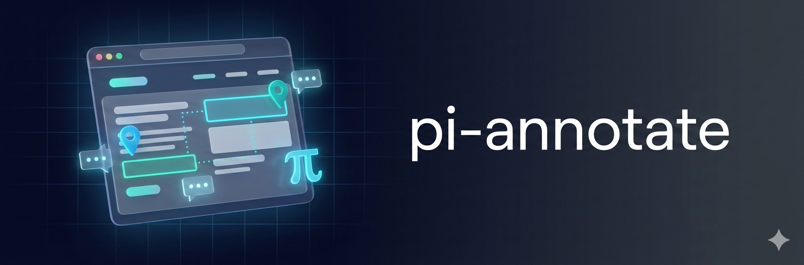

<p>
  
</p>

# Pi Annotate

**Visual feedback from browser to AI. Click elements, add comments, fix code.**

[](LICENSE)
[]()

```bash
# Click the extension icon (or Cmd+Shift+A)
# Click what's broken, add comments
# Send to Pi → Pi fixes it
```

Describing UI issues to an AI is tedious. "The button in the header, no the other one, the blue one on the right..." Just click instead.

- **Point and Click** — Click any element, add a comment. Captures CSS selectors, classes, computed styles, accessibility info.
- **Bidirectional Chat** — Send annotations to Pi, continue the conversation from your browser.
- **Two Workflows** — Invoke from Pi (`annotate` tool) or from browser (click icon or Cmd+Shift+A).
- **Smart Identification** — Multi-select with drag, text selection for typos, area selection for layout issues.

## Quick Start

### 1. Build Chrome Extension

```bash
npm run setup
```

### 2. Load in Chrome

1. Open `chrome://extensions`
2. Enable **Developer mode**
3. Click **Load unpacked**
4. Select the `chrome-extension/` folder
5. Copy the **Extension ID** shown

### 3. Install Native Host

```bash
cd chrome-extension/native
chmod +x install.sh
./install.sh <extension-id>
```

Restart Chrome after installation.

### 4. Enable Pi Extension

Copy or symlink to your extensions directory:

```bash
# Symlink (for development)
ln -s "$(pwd)" ~/.pi/agent/extensions/pi-annotate

# Or copy
cp -r . ~/.pi/agent/extensions/pi-annotate
```

Restart Pi to load the extension.

## Usage

### From Pi (Tool Invocation)

```
> Help me fix the styling issues on this page

# Pi invokes: annotate({ url: "http://localhost:3000" })
# Chrome opens the toolbar
# Click elements, add comments
# Click "Send to Pi"
# Pi receives annotations and makes changes
```

### From Browser (Manual)

```
# Press Cmd+Shift+A (or click extension icon)
# Click elements, add comments
# Click "Send to Pi" to send annotations
# Or "Send with Chat" to start a conversation
```

### Activation

| Method | Action |
|--------|--------|
| Click extension icon | Toggle annotation toolbar |
| `Cmd+Shift+A` | Toggle annotation toolbar |

## Features

**Annotation Modes**
- **Single click** — Annotate any element
- **Multi-select** — Drag to select multiple elements
- **Text selection** — Highlight text for typos/content feedback
- **Area selection** — Draw regions for layout issues

**Smart Capture**
- CSS selectors and element paths
- Class names and computed styles
- Accessibility info (ARIA roles, labels)
- Bounding boxes and positions
- Selected text context

**Output Levels**
| Level | Description |
|-------|-------------|
| Compact | Element + comment only |
| Standard | Path, classes, size |
| Detailed | Styles, accessibility, context |
| Forensic | Full DOM path, all metadata |

**UI Features**
- Draggable toolbar
- Dark/light theme
- Freeze CSS animations
- Persistence (localStorage, 7 days)

## Output Format

The tool returns markdown optimized for LLM consumption:

```markdown
## Page Feedback: http://localhost:3000/dashboard
**Viewport:** 1440×900

### 1. Button "Submit"
Make this larger and more prominent
- **Path:** `form > button.submit-btn`
- **Classes:** `.submit-btn`, `.btn-primary`
- **Size:** 120×40px

### 2. Text "Welcome back"
> "Welcome back"

Change color to match brand guidelines
```

## Architecture

```
┌─────────────────┐                      ┌───────────────────┐
│  Pi Extension   │◄── Unix Socket ────►│   Native Host     │
│  (annotate tool)│ /tmp/pi-annotate.sock│   (host.cjs)      │
└─────────────────┘                      └─────────┬─────────┘
                                                   │
                                         Native Messaging
                                                   │
                                         ┌─────────▼─────────┐
                                         │ Chrome Extension  │
                                         │ (React toolbar)   │
                                         └───────────────────┘
```

| Component | Purpose |
|-----------|---------|
| `index.ts` | Pi extension, registers `annotate` tool |
| `types.ts` | Shared TypeScript types |
| `generate-output.ts` | Markdown output generator |
| `chrome-extension/src/` | React app (Toolbar, ChatPanel) |
| `chrome-extension/native/host.cjs` | Native messaging bridge |
| `chrome-extension/src/background.ts` | Service worker |

### Message Flow

**Tool invocation:**
```
Pi → Socket → Native Host → Chrome Background → Content Script → Toolbar
```

**Annotations returned:**
```
Toolbar → Content Script → Chrome Background → Native Host → Socket → Pi
```

## Configuration

### Tool Parameters

```typescript
annotate({
  url?: string,    // URL to navigate to (optional)
  timeout?: number // Seconds to wait (default: 300)
})
```

### Toolbar Settings

Access via the gear icon in the toolbar:

| Setting | Description |
|---------|-------------|
| Output Detail | Compact / Standard / Detailed / Forensic |
| Auto-clear | Clear annotations after sending |
| Annotation Color | Marker highlight color |
| Block Interactions | Prevent accidental clicks while annotating |

## Development

### Chrome Extension

```bash
npm run dev    # Watch mode
npm run build  # Production build
```

After changes: Reload at `chrome://extensions`

### Pi Extension

TypeScript files are loaded directly via jiti (no build step).

After changes: Restart Pi

### Logs

```bash
# Native host logs
tail -f /tmp/pi-annotate-host.log

# Browser console
# Open DevTools on any page with the extension active
```

## Troubleshooting

| Issue | Solution |
|-------|----------|
| "Pi Annotate Chrome extension not running" | Check extension is enabled at `chrome://extensions` |
| Native host not connecting | Verify installation: `ls ~/Library/Application\ Support/Google/Chrome/NativeMessagingHosts/com.pi.annotate.json` |
| Annotations not sending | Check socket exists: `ls -la /tmp/pi-annotate.sock` |
| Extension not loading in Pi | Ensure `package.json` has `"pi": { "extensions": ["./index.ts"] }` |
| Toolbar not appearing | Check browser console for errors, try reloading the page |

### Reset Native Host

```bash
cd chrome-extension/native
./install.sh <extension-id>
# Restart Chrome
```

## Credits

- **[Agentation](https://github.com/benjitaylor/agentation)** — UI components adapted from Benji Taylor, Dennis Jin, and Alex Vanderzon
- **[Surf CLI](https://github.com/nicobailon/surf-cli)** — Native messaging patterns
- **[Pi coding agent](https://github.com/badlogic/pi-mono)** — Extension framework

## License

MIT
